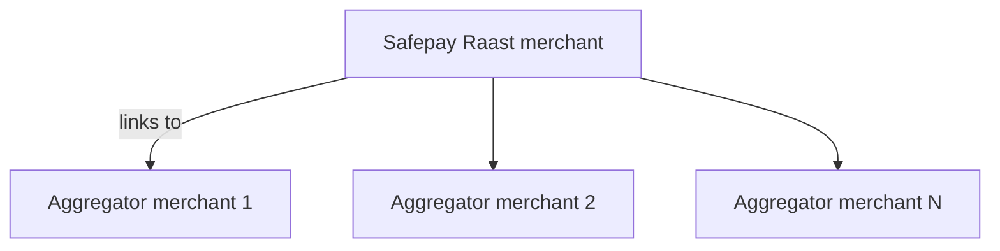

Aggregator merchants represent the businesses you process payments for. They sit under an [aggregator](/concepts/aggregator), inherit its credentials, and must link to a Safepay-managed [Raast merchant](/concepts/raast-merchants) before you can move money on their behalf.

| Field | Type | Required? | Example | Notes |
| --- | --- | --- | --- | --- |
| `merchant_external_id` | string | Yes | sec_0c3de397-441f-471f-bcd7-b6d948e1c307 | Stable identifier you supply across environments. |
| `iban` | string | Yes | PK62ABPA0010000222380013 | Settlement IBAN for payouts. |
| `name` | string | Yes | Acme Foods Saddar | Display name shown in dashboards and reports. |
| `enabled` | boolean | No | true | Set to `true` to activate immediately. |
| `raast_merchant_id` | string | Yes | mer_eb2f5757-c0e4-4eb4-ad4b-2f4b671a84e2 | Links to a Safepay Raast merchant. |
| `rate_card.ratecard_kind` | enum | Yes | RateCardKind_fixed | Choose the pricing model. |
| `rate_card.fixed_rate` | integer | Required for fixed | 3000 | Fee in paisa when using a fixed card. |
| `rate_card.tax_region` | string | No | PK | Region where the tax applies. |
| `rate_card.tax_rate` | number | Yes | 0.1 | Tax rate applied to transactions. |

<Callout type="info">Safepay performs KYC/KYB on every merchant. Payments remain blocked until the merchant status becomes `ENABLED`.</Callout>



- One aggregator merchant can link to only one Raast merchant.
- A single Raast merchant can be shared across many aggregators. This lets a business entity use multiple aggregators without re-onboarding.

### Create a merchant

Use the Aggregator Merchants API to create and link a merchant. Replace placeholders with your real values. The header name must match the OpenAPI security scheme (`X-SFPY-AGGREGATOR-SECRET-KEY`).

<CodeGroup>

```bash cURL
curl --request POST "{{base_url}}/v1/aggregators/{{aggregator_id}}/merchants" \
  --header "X-SFPY-AGGREGATOR-SECRET-KEY: {{secret_key}}" \
  --header "Content-Type: application/json" \
  --data '{
    "merchant_external_id": "sec_0c3de397-441f-471f-bcd7-b6d948e1c307",
    "iban": "PK62ABPA0010000222380013",
    "name": "Acme Foods Saddar",
    "enabled": true,
    "raast_merchant_id": "{{raast_merchant_id}}",
    "rate_card": {
      "ratecard_kind": "RateCardKind_fixed",
      "fixed_rate": 3000,
      "tax_region": "PK",
      "tax_rate": 0.1
    }
  }'
```

```typescript TypeScript
type CreateMerchantPayload = {
  api_version: string;
  data: {
    token: string;
    merchant_external_id: string;
    enabled: boolean;
    name: string;
  };
};

const res = await fetch(
  `${process.env.SAFEPAY_BASE_URL}/v1/aggregators/${process.env.SAFEPAY_AGGREGATOR_ID}/merchants`,
  {
    method: 'POST',
    headers: {
      'Content-Type': 'application/json',
      'X-SFPY-AGGREGATOR-SECRET-KEY': process.env.SAFEPAY_SECRET_KEY ?? '',
    },
    body: JSON.stringify({
      merchant_external_id: 'sec_0c3de397-441f-471f-bcd7-b6d948e1c307',
      iban: 'PK62ABPA0010000222380013',
      name: 'Acme Foods Saddar',
      enabled: true,
      raast_merchant_id: process.env.SAFEPAY_RAAST_MERCHANT_ID,
      rate_card: {
        ratecard_kind: 'RateCardKind_fixed',
        fixed_rate: 3000,
        tax_region: 'PK',
        tax_rate: 0.1,
      },
    }),
  },
);

if (!res.ok) {
  const error = await res.json();
  throw new Error(`Merchant creation failed: ${error.message}`);
}

const payload: CreateMerchantPayload = await res.json();
const aggregatorMerchantIdentifier = payload.data.token;
console.log('Aggregator merchant identifier', aggregatorMerchantIdentifier);
```

</CodeGroup>

<Callout type="tip">Keep the returned `data.token` in your vault. Safepay refers to it as the `aggregator_merchant_identifier` when you create payments, QR codes, refunds, and payouts.</Callout>

### Merchant lifecycle

1. **Created** — Safepay receives your request and assigns an ID.
2. **Pending checks** — KYC/KYB validations run. Provide documentation if requested.
3. **Enabled** — Payment, QR, and payout endpoints accept this merchant.
4. **Disabled** — Safepay can suspend a merchant; payment requests will fail until re-enabled.

Re-use the `List merchants` and `Get merchant` endpoints to monitor these transitions during onboarding.
