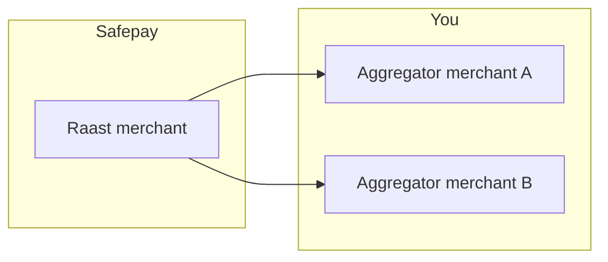

import { Callout } from '~/ui/components/Snippet'

Safepay maintains a registry of Raast merchants - business entities that are fully onboarded with the Raast switch. Your [aggregator merchants](/concepts/merchant) must link to one of these records via `raast_merchant_id` to inherit settlement permissions.

| Field | Description |
| --- | --- |
| `id` | Unique Raast merchant identifier (for example, `mer_2cab1524-805d-4a09-8e51-924ddf3f43ea`). |
| `legal_name` | Registered business name on the Raast network. |
| `industry` | Optional classification that informs risk tooling. |
| `status` | Lifecycle state (`AVAILABLE`, `RESTRICTED`, `RETIRED`). |

### Mapping workflow

1. Query [List Raast merchants](/api-reference#get-/v1/aggregators/-raast-aggregator-id-/raast-merchants) to find the entity you need.
2. Confirm the status is `AVAILABLE`. If not, contact support for guidance.
3. Reference the `id` in your merchant creation payload (`raast_merchant_id`).
4. Safepay validates the relationship and enables the aggregator merchant after KYC/KYB.

<Callout type="info">If the Raast merchant you need is missing, include its documentation in your aggregator onboarding request. Safepay will create it and share the new `raast_merchant_id`.</Callout>

### Due diligence

When you link to an existing Raast merchant, Safepay reuses the previously approved documentation. New Raast merchants require:

- Business registration documents
- Beneficial ownership details
- Expected monthly volume and average ticket size
- Contact information for compliance escalation

Processing can take longer when these artifacts are missing or incomplete.

## Key endpoints

| Endpoint | Purpose |
| --- | --- |
| `GET /v1/aggregators/{{aggregator_id}}/raast-merchants` | List Raast merchants with filters and pagination. |
| `GET /v1/aggregators/{{aggregator_id}}/raast-merchants/{{raast_merchant_id}}` | Read a single Raast merchant. |

## See also

- [Aggregator merchants](/concepts/merchant)
- [Quickstart](/overview/quickstart)
- [Raast integration journey](/guides/raast-integration-journey)
- [API reference](/api-reference)
